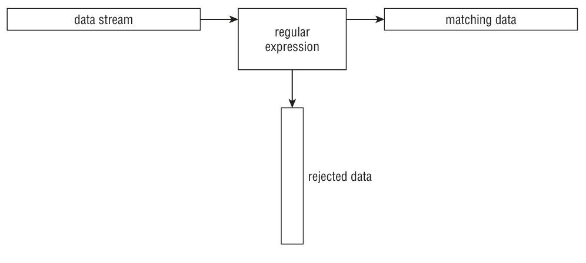

A regular expression is a pattern template user define that a Linux utility uses to fi lter text.

A Linux utility (such as the sed editor or the gawk program) matches the regular expression pattern against data as that data fl ows into the utility.

## Types of regular expressions
1. POSIX Basic Regular Expression (BRE) Engine:
- Used by most Linux utilities (like grep, sed).
- It has a simpler set of symbols, but some utilities (like sed) only support a subset for speed reasons.

2. POSIX Extended Regular Expression (ERE) Engine:
- Found in programming languages (like Python, Perl, and Java) and tools like gawk.
- Provides more advanced pattern symbols and special shortcuts for common patterns (like digits or words).

a. Plain Text Matching:
You can match specific words in the text using a simple pattern.

`echo "This is a test" | sed -n '/test/p'`

This matches the word "test" and prints the line.

If the word doesn't exist, no output is printed.

`echo "This is a test" | sed -n '/trial/p'`

b. Case Sensitivity:
BRE patterns are case-sensitive.

`echo "This is a test" | sed -n '/this/p'`

This will not match because "this" is lowercase, but:

`echo "This is a test" | sed -n '/This/p'`

This matches because the case is correct.

c. Matching Substrings:
The pattern doesn't need to match an entire word; it can match a part of the string.

`echo "The books are expensive" | sed -n '/book/p'`

This will match because "book" appears in "books."

d. Spaces in Patterns:
Spaces in patterns are treated like any other character, so they must match exactly.

`echo "This is line number 1" | sed -n '/ber 1/p'`

Matches because the pattern includes the space and "ber 1."

If there’s no exact match, the regular expression will fail:

`echo "This is line number1" | sed -n '/ber 1/p'`

e. Multiple Spaces:
You can match multiple contiguous spaces using the regular expression.

`echo "This is  a line with too many spaces." | sed -n '/  /p'`

This will match lines with two spaces.