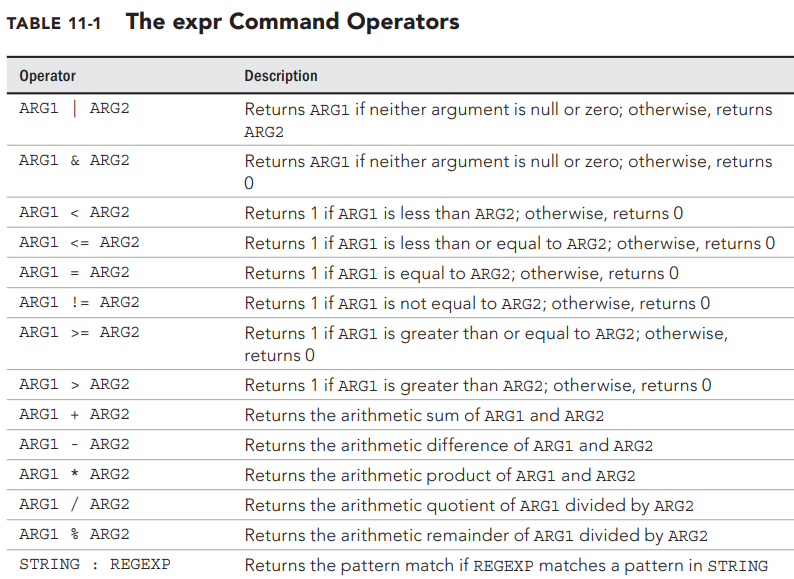
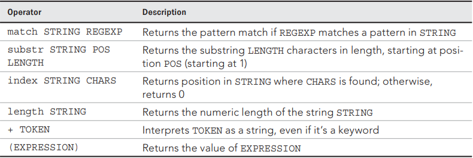

Write a Bash script that processes an employee’s salary with the following rules:

🔹Step 1 – Take Input
Prompt the user to enter:
Basic Salary (basic)
Bonus Percentage (bonus\_percent)
Tax Percentage (tax\_percent)

🔹Step 2 – Calculate Salary Components
calculate:
Bonus Amount
bonus=(basic×bonus\_percent)/100

Gross Salary
gross=basic+bonus

Tax Amount
tax=(gross×tax_percent)/100

Net Salary
net=gross−tax

🔹Step 3 – Incentive Rule (New Logic)
Now apply this condition:
If net > 50000
Calculate 5% incentive on the current net salary
incentive=(net×5)/100

Add the incentive to net salary
final_net=net+incentive
Else
final_net = net

🔹Step 4 – Even/Odd Check
Check whether final_net is:
EVEN → print "Final Net Salary is EVEN"
ODD → print "Final Net Salary is ODD"

🔹Step 5 – Output
Display:
Bonus
Gross Salary
Tax
Net Salary (before incentive)
Incentive (if applied)
Final Net Salary
Even/Odd result

